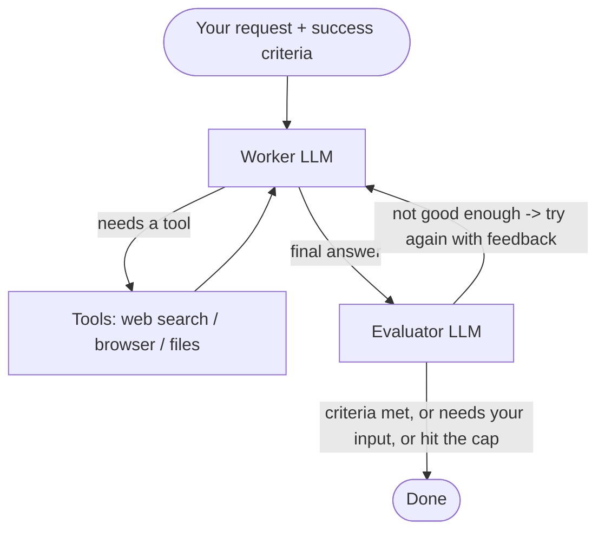

# 🤖 AI Assistant Agent

A LangGraph agent that works toward a goal **until it meets your success criteria**. You give it a
request *and* a definition of "done"; a worker LLM attempts the task with a toolbox, and a separate
evaluator LLM checks the result and either accepts it, asks you for input, or sends it back for
another attempt. Runs in a small Gradio web UI.


## How it works



In one sentence: a **worker** tries to do the task with tools; an **evaluator** checks the result
against your success criteria and either accepts it or sends it back for another try.


- **Worker** (LLM + tools) attempts the task, looping through tools as needed.
- **Evaluator** (LLM with structured output) judges the answer against your success criteria and
  returns `{feedback, success_criteria_met, user_input_needed}`.
- The run **loops back** to the worker (with the feedback) until the criteria are met, the user is
  needed, or an **iteration cap** is reached.
- State is checkpointed per session (`MemorySaver`).

## Tools

- 🌐 **Web search** (Serper) and **page browsing** (Playwright — drives a real Chromium browser)
- 📁 **File management** (sandboxed to `sandbox/`)

## Setup

```bash
pip install -r requirements.txt
playwright install            # one-time: download the browser
```

Create a `.env`:

```
OPENAI_API_KEY=...
SERPER_API_KEY=...
```

## Run

```bash
python app.py
```

## Configuration (env vars)

| Variable | Default | Purpose |
|----------|---------|---------|
| `WORKER_MODEL` | `gpt-4o-mini` | LLM that does the work |
| `EVALUATOR_MODEL` | `gpt-4o-mini` | LLM that judges the work (set a stronger model here if you like) |
| `MAX_ITERATIONS` | `3` | Cap on worker↔evaluator retries |
| `HEADLESS` | `true` | Set `false` to watch the browser |

## Tests

```bash
pytest -v
```

The tests cover the graph's routing logic (tool vs. evaluate, and the accept / ask-user / retry /
iteration-cap decisions) with no API keys or browser required.

## Project layout

- `app.py` — Gradio UI
- `assistant.py` — the agent: LangGraph worker/evaluator graph
- `tools.py` — the toolbox (search, browser, files)
- `logic.py` — pure routing logic (unit-tested)
- `tests/` — routing tests

